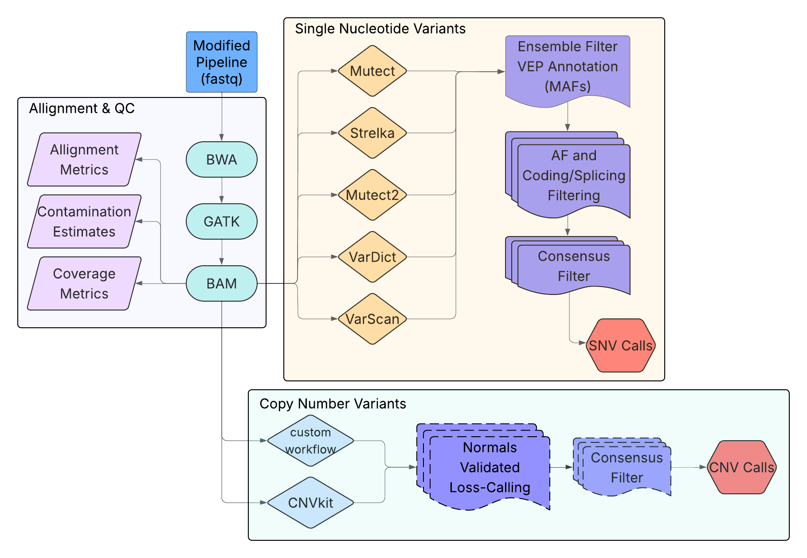

# Tumor-Only Targeted Sequencing Pipeline (HPC-Optimized)

This repository contains a customized DNA sequencing analysis pipeline derived from
the PuLab pipeline-suite and adapted for **tumor-only targeted sequencing data**
executed on a **high-performance computing (HPC)** environment.

The pipeline has been extensively modified to support:
- Tumor-only samples (no matched normals)
- Targeted capture sequencing
- Cohort-based CNV calling
- Multi-caller SNV detection
- SLURM-based job execution
- Dataset- and cluster-specific configuration via YAML files

This repository includes both:
1. All components of the PuLab pipeline-suite (primarily for preprocessing), and  
2. Custom scripts and workflows layered on top to support tumor-only SNV and CNV analysis.

---

## Key Features

- Modular, stepwise workflow
- HPC-compatible (SLURM job submission)
- YAML-based configuration for reproducibility
- CNV calling using CNVkit and a custom cohort-based workflow 
- SNV calling using five independent variant callers
- Designed specifically for tumor-only targeted sequencing data

---

## Pipeline Structure

The pipeline is organized into four main components, each contained within
its own directory and documented independently.

### 1. Preparation
**Target and configuration setup**
- BED file preparation and formatting
- Generation of YAML configuration files containing sample data,
  and file paths

→ `01_preparation/`

---

### 2. Preprocessing
**Read- and alignment-level processing**
- FASTQC and BAMQC quality control
- Alignment using BWA-MEM
- GATK base quality score recalibration

→ `02_preprocessing/`

> **Note:**  
> Steps 1 and 2 are the only stages that directly rely on components of the PuLab pipeline-suite.

---

### 3. Copy Number Variant (CNV) Loss Calling
**Cohort-based CNV detection**
- CNV calling using CNVkit
- Custom cohort-based CNV calling
- Consensus of CNV Loss calls (validated by normal datasets)
- Designed for tumor-only targeted sequencing data

→ `03_cnv_calling/`

---

### 4. Single Nucleotide Variant (SNV) Calling
**Multi-caller SNV detection**
- SNV calling using five independent variant callers
- Tumor-only filtering and aggregation
- Output harmonized for downstream analysis

→ `04_snv_calling/`

---

Each directory contains its own `README.md` with detailed documentation on:
- Purpose of the module
- Required inputs
- Generated outputs
- Script-level usage examples

---

## Software Environments

This pipeline requires **two separate conda environments** to be installed
prior to execution. Environment definitions are provided in the `environments/`
directory.

### Required Conda Environments

- **`cnvkit_env`**
  - Used for CNV calling and python scripts where pandas is used

- **`vep_env`**
  - Used for variant annotation with Ensembl VEP

Each environment should be created explicitly before running the corresponding
pipeline stages. See the `environments/` directory for environment YAML files
and installation instructions.

---

## Configuration Files

### `configs/` Directory

The `configs/` directory contains the `dna_pipeline_config.yaml`,
which documents:
- Tool names and versions
- Reference genome resources
- General pipeline settings

This configuration file is included primarily for **documentation,
provenance, and consistency** with the original PuLab pipeline-suite.
Modifying aspects of the config will only alter Steps 01 and 02.

---

### Important Note on Tool Versions

With the exception of **Preparation (Step 1)** and **Preprocessing (Step 2)**:

- The CNV and SNV workflows **do not dynamically read tool versions**
  from the PuLab pipeline configuration YAML.
- Tool versions for CNV and SNV calling are controlled by:
  - The active conda environment
  - The standalone scripts used in `03_cnv_calling/` and `04_snv_calling/`

As a result:

> Changing tool versions (e.g., VarScan, GATK, etc.) in the configs
> YAML **will not affect CNV or SNV calling behavior**
> unless the corresponding environment or scripts are explicitly updated.

The configuration YAML is therefore best interpreted as a **reference snapshot**
of tool versions rather than an execution-level controller for all pipeline stages.

---

## Getting Started (High-Level)

At a high level, running the pipeline involves:

1. Preparing target BED files and a YAML configuration file
2. Running preprocessing and alignment
3. Performing CNV calling
4. Performing SNV calling and downstream filtering

Users should follow the documentation in each module directory in order.
The pipeline is designed to be run stepwise, with outputs from each stage
serving as inputs to the next.

---

## Note on Legacy Components

This repository retains additional modules and scripts from the original
PuLab pipeline-suite that are **not currently used** in the tumor-only workflow.
These components are preserved for:
- Future extensibility
- Reference and reproducibility
- Transparency with respect to the upstream pipeline architecture

---

## Workflow Overview

The figure below summarizes the **current workflow implemented in this repository**,
highlighting the components actively used for tumor-only targeted sequencing analysis.

---

## Original Pipeline and Attribution

This workflow is derived from the **PughLab pipeline-suite**, with substantial
modifications to support tumor-only targeted sequencing, CNV calling,
and HPC-specific execution requirements.

For details on the original pipeline architecture, additional modules,
and broader use cases, please refer to the original documentation:

- PuLab pipeline-suite repository and wiki: *([wiki](https://github.com/pughlab/pipeline-suite/wiki))*

---

## Contact / Further Information

For questions, extensions, or dataset-specific adaptations, please contact
the repository maintainer or consult the documentation within each module.
